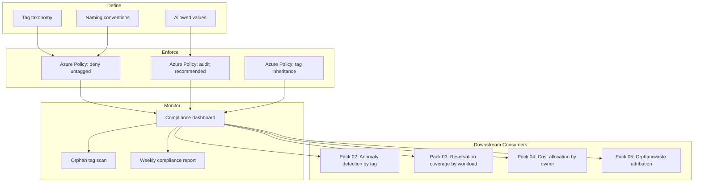

# Cost Governance & Tagging Policy Pack

> You cannot govern what you cannot see. In cloud infrastructure, visibility begins with cost allocation metadata — the tags that transform anonymous resources into accountable, attributable spending. An untagged resource is an unaccountable dollar — you don't know who owns it, why it exists, or whether it should.

[]()
[]()

---

> **Governance Notice** — This pack is governed by the [Stella Maris Constitution (CONST-01)](https://github.com/stella-maris-governance/smg-enterprise-hq) and enforces **POL-FIN-01 (Financial Operations) · FinOps Foundation · NIST CM-8**. All dispositions are subject to the Two-Person Integrity Protocol.

---

## Start Here

| You Are | Read This First |
|---------|----------------|
| **Hiring Manager** | This README then [`expected-vs-observed.md`](docs/expected-vs-observed.md) — proves cloud cost governance is systematic, not ad hoc |
| **Consulting Client** | [`expected-vs-observed.md`](docs/expected-vs-observed.md) — what percentage of your cloud resources have an owner tag? If you don't know, start here. |
| **Auditor / GRC** | [`expected-vs-observed.md`](docs/expected-vs-observed.md) then [`control-mapping.md`](docs/control-mapping.md) — FinOps Foundation, NIST 800-53 SA-4/PM-30 alignment |
| **CFO / Finance** | This README — proves every cloud dollar is traceable to an owner, project, and environment |
| **Engineer** | [`/code/`](code/) for tagging policies and compliance scripts then [`tagging-operations-runbook.md`](docs/tagging-operations-runbook.md) |

---

## The Problem

A cloud subscription with 200 resources and no tagging policy is a filing cabinet with no labels. Every document is in there somewhere. Good luck finding anything. Good luck knowing who put it there. Good luck knowing if it should still be there.

Organizations adopt cloud and start provisioning resources. Developers spin up VMs for testing. Engineers create storage accounts for migrations. Someone provisions a database for a proof of concept that ended 8 months ago. Nobody puts their name on it. Nobody tags it with a project. Nobody marks it as test or production.

Twelve months later, the cloud bill is $47,000/month. Finance asks: "What is this for?" Engineering says: "We'd have to look into it." Nobody can answer three basic questions: Who owns this resource? Why does it exist? Should it still be running?

In aerospace logistics, every part has a part number, a lot number, and a cage code. You can trace any bolt to a manufacturer, a purchase order, and a receiving inspection. The same discipline applies to cloud resources. Every resource gets a tag. The tag tells you who owns it, what it's for, how critical it is, and when it was last reviewed. Without this, every pack in the FinOps pillar is blind.

---

## What This Pack Delivers

| Capability | What It Does | How |
|-----------|-------------|-----|
| **Cost allocation metadata taxonomy** | Standard set of required and recommended tags for all cloud resources | Documented taxonomy with naming conventions and allowed values |
| **Tag enforcement policy** | Azure Policy denies resource creation without required tags | `deny` policy for required tags, `audit` for recommended |
| **Tag compliance monitoring** | Continuous measurement of tagging compliance across all subscriptions | Azure Policy compliance dashboard, weekly reports |
| **Tag inheritance** | Resource groups pass tags to child resources | Azure Policy `modify` effect for tag inheritance |
| **Orphan tag detection** | Identify tags with invalid values (wrong owner, defunct project) | Quarterly tag hygiene scan |
| **Cost allocation foundation** | Tags enable cost breakdown by owner, project, environment, criticality | Cost Management group-by-tag analysis |

---

## Architecture


---

## Tag Taxonomy

### Required Tags (Enforced — `deny` if missing)

| Tag Key | Description | Example Values | Rationale |
|---------|-------------|---------------|-----------|
| `Owner` | Individual or team accountable for this resource | `robert.myers`, `platform-team` | Every resource has a name on it. No orphans. |
| `Environment` | Deployment stage | `production`, `staging`, `development`, `sandbox`, `test` | A test VM running at production scale is waste. You can't catch it without this tag. |
| `CostCenter` | Financial allocation code | `CC-1001`, `CC-2050` | Finance needs to allocate costs. This is the bridge between engineering and finance. |
| `Project` | Project or workload this resource supports | `stella-maris`, `customer-portal`, `data-pipeline` | Ties resources to business purpose. A resource with no project has no justification. |

### Recommended Tags (Audited — `audit` if missing)

| Tag Key | Description | Example Values | Rationale |
|---------|-------------|---------------|-----------|
| `Criticality` | Business criticality | `critical`, `high`, `medium`, `low` | Informs Pack 03 reservation decisions and Pack 05 right-sizing priority. |
| `DataClassification` | Sensitivity of data on this resource | `public`, `internal`, `confidential`, `restricted` | Bridges FinOps to security. A `restricted` resource should have higher security spend justified. |
| `CreatedDate` | When the resource was provisioned | `2026-01-15` | Enables age-based waste detection. A 9-month-old sandbox VM is a candidate for decommission. |
| `ReviewDate` | When this resource was last reviewed for necessity | `2026-02-01` | Forces periodic justification. No resource runs forever without someone confirming it should. |
| `ExpiryDate` | When this resource should be decommissioned | `2026-06-30` | Enables proactive cleanup. Temporary resources have a defined end of life. |
| `ManagedBy` | Automation or tool managing this resource | `terraform`, `bicep`, `manual` | Manually provisioned resources are more likely to become orphaned. |

---

## Tag Naming Conventions

| Rule | Convention | Example |
|------|-----------|---------|
| Case | camelCase for tag keys | `costCenter`, not `Cost_Center` or `COSTCENTER` |
| Spaces | No spaces in keys or values | `platform-team`, not `platform team` |
| Owner format | First.Last or team-name | `robert.myers` or `platform-team` |
| Environment values | Lowercase, from allowed list | `production`, `staging`, `development`, `sandbox`, `test` |
| CostCenter format | `CC-` prefix + 4-digit code | `CC-1001` |
| Date format | ISO 8601 | `2026-02-12` |

---

## Azure Policy Assignments

### Policy 1 — Require Required Tags (Deny)
```json
{
  "effect": "deny",
  "condition": "any required tag is missing",
  "tags": ["Owner", "Environment", "CostCenter", "Project"],
  "scope": "All subscriptions",
  "exclusions": "Microsoft-managed resource groups (e.g., NetworkWatcher)"
}
```

### Policy 2 — Audit Recommended Tags (Audit)
```json
{
  "effect": "audit",
  "condition": "any recommended tag is missing",
  "tags": ["Criticality", "DataClassification", "CreatedDate", "ReviewDate"],
  "scope": "All subscriptions"
}
```

### Policy 3 — Tag Inheritance (Modify)
```json
{
  "effect": "modify",
  "action": "If child resource missing tag, inherit from resource group",
  "tags": ["Owner", "Environment", "CostCenter", "Project"],
  "scope": "All subscriptions"
}
```

### Policy 4 — Allowed Values (Deny)
```json
{
  "effect": "deny",
  "condition": "Environment tag value not in allowed list",
  "allowed": ["production", "staging", "development", "sandbox", "test"],
  "scope": "All subscriptions"
}
```

---

## Compliance Targets

| Metric | Target | Measurement |
|--------|--------|-------------|
| Required tag compliance | 95% within 30 days, 99% within 90 days | Azure Policy compliance state |
| Recommended tag compliance | 80% within 90 days | Azure Policy compliance state |
| Tag value accuracy | No orphan tags (invalid owner, defunct project) | Quarterly hygiene scan |
| New resource compliance | 100% (deny policy prevents non-compliant creation) | Azure Policy deny count |

---

## Compliance Mapping

| Framework | Control ID | Control Name | Implementation |
|-----------|-----------|--------------|----------------|
| FinOps Foundation | Capability: Cost Allocation | Metadata and Hierarchy | Tag taxonomy enables cost allocation |
| FinOps Foundation | Capability: Data Analysis | Reporting and Analytics | Tags enable group-by analysis |
| NIST 800-53 | SA-4 | Acquisition Process | Resource tagging as procurement governance |
| NIST 800-53 | PM-30 | Supply Chain Risk Management Strategy | Cost traceability as supply chain financial governance |
| NIST 800-53 | CM-8 | Information System Component Inventory | Tags as component inventory mechanism |

> Full mapping: [`docs/control-mapping.md`](docs/control-mapping.md)

---

## What's Included

### `code/` — Policies, Scripts, and Dashboards

| File | Description |
|------|-------------|
| `tag-policy-required.json` | Azure Policy: deny resource creation without required tags |
| `tag-policy-audit.json` | Azure Policy: audit resources missing recommended tags |
| `tag-policy-inherit.json` | Azure Policy: inherit tags from resource group |
| `tag-policy-allowed-values.json` | Azure Policy: restrict Environment tag to allowed values |
| `tag-compliance-report.py` | Python: generate tag compliance report from Azure Resource Graph |
| `tag-hygiene-scan.py` | Python: detect orphan tags (invalid owner, defunct project) |
| `deploy-tag-policies.ps1` | PowerShell: deploy all tag policies to subscriptions |

### `docs/` — SOPs, Runbooks, Evidence

| File | Description |
|------|-------------|
| [`expected-vs-observed.md`](docs/expected-vs-observed.md) | The Law of Evidence — 10 controls |
| [`tagging-operations-runbook.md`](docs/tagging-operations-runbook.md) | Full tagging governance SOP |
| [`control-mapping.md`](docs/control-mapping.md) | FinOps Foundation / NIST alignment |

### `screenshots/` — Evidence

This pack uses **deterministic engine outputs** as primary evidence rather than portal screenshots.

| Evidence Type | Format | Purpose |
|--------------|--------|---------|
| Engine output (`.txt`) | Script terminal output | Primary — proves logic and methodology |
| Report output (`.md`) | Formatted engine report | Primary — proves analysis and findings |
| Portal screenshot (`.png`) | Azure portal capture | Secondary — added when running against live environment |

> See `EVIDENCE-README.md` in the screenshots directory for the full evidence approach.

---

## Deployment Guide

| Step | Action | Duration |
|------|--------|----------|
| 1 | Define tag taxonomy with stakeholders (engineering, finance, security) | 2 hours |
| 2 | Document naming conventions and allowed values | 1 hour |
| 3 | Deploy tag policies in audit mode first (30-day observation) | 1 hour |
| 4 | Run initial tag compliance report: measure baseline | 1 hour |
| 5 | Remediate existing resources: tag backfill campaign | 4-8 hours (depends on resource count) |
| 6 | Switch required tag policies from audit to deny | 30 min |
| 7 | Configure tag inheritance policy | 30 min |
| 8 | Set up weekly compliance report | 1 hour |
| 9 | Run first tag hygiene scan | 1 hour |
| 10 | Capture screenshots and complete E-v-O | 1 hour |

> **Watchstander Note:** Step 3 is critical. Deploy in audit mode first. If you deploy deny immediately, every engineer who tries to create a resource without tags will be blocked — and they'll route around the policy by complaining until it's removed. The audit period gives you data: how many resources would have been blocked? Who's already tagging? Who needs training? Lead with data, then enforce.

---

## Related Packs

| Pack | Relationship |
|------|-------------|
| [Anomaly Detection](../02-anomaly-detection-alerting/) | Tags enable anomaly detection by category (owner, project, environment) |
| [Reserved Instance Optimization](../03-reserved-savings-optimization/) | Workload tags inform reservation commitment decisions |
| [Chargeback & Showback](../04-chargeback-showback/) | Tags are the allocation mechanism — no tags = unallocatable costs |
| [Waste Elimination](../05-waste-elimination-rightsizing/) | Tags identify owners for waste attribution and remediation |
| [Supply Chain Pack 01](../../supply-chain-scrm-packs/01-vendor-risk-assessment/) | Vendor cost tracking feeds from tagged vendor-related resources |

---

## Changelog

| Version | Date | Change |
|---------|------|--------|
| 1.0.0 | 2026-02-12 | Initial release |

---

<div align="center">

**© 2026 Stella Maris Governance LLC**

*The work speaks for itself. Stella Maris — the one light that does not drift.*

</div>
