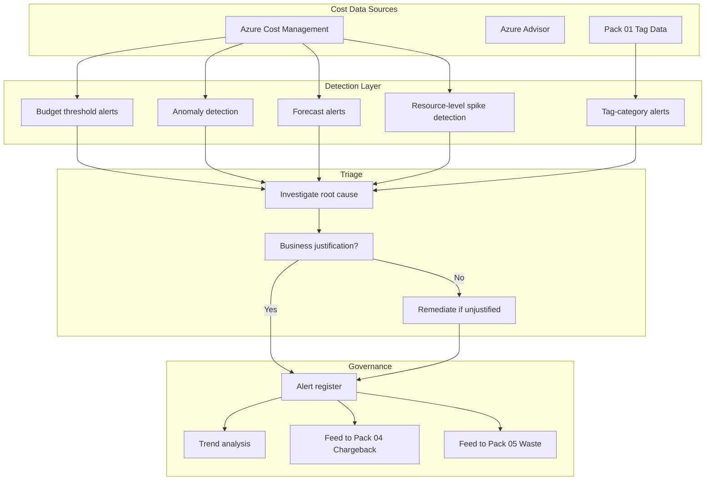

# Anomaly Detection & Cost Alerting Pack

> A 40% cost spike on Tuesday afternoon is either a business event or a billing event. If it's a business event — a product launch, a migration, a load test — it's expected. If nobody can explain it, it's an anomaly. This pack ensures you find out which one before the invoice arrives.

---

> **Governance Notice** — This pack is governed by the [Stella Maris Constitution (CONST-01)](https://github.com/stella-maris-governance/smg-enterprise-hq) and enforces **POL-FIN-01 (Financial Operations) · FinOps Foundation · NIST SI-4**. All dispositions are subject to the Two-Person Integrity Protocol.

---

## Start Here

| You Are | Read This First |
|---------|----------------|
| **Hiring Manager** | This README then [`expected-vs-observed.md`](docs/expected-vs-observed.md) — proves cost monitoring is proactive, not reactive |
| **Consulting Client** | [`expected-vs-observed.md`](docs/expected-vs-observed.md) — when was the last time you caught a cost anomaly before the monthly invoice? |
| **Auditor / GRC** | [`expected-vs-observed.md`](docs/expected-vs-observed.md) then [`control-mapping.md`](docs/control-mapping.md) — FinOps Foundation, NIST SA-4/PM-30 alignment |
| **CFO / Finance** | This README — proves every cost spike is investigated and explained before it becomes a budget variance |
| **Engineer** | [`/code/`](code/) for alert rules and anomaly detection then [`anomaly-operations-runbook.md`](docs/anomaly-operations-runbook.md) |

---

## The Problem

Cloud costs don't arrive in a predictable monthly invoice like a lease payment. They arrive as a continuously accruing meter — hundreds of meters, actually — each one ticking at a rate that depends on what's running, how much it's consuming, and whether someone accidentally left a 64-core VM running over the weekend.

Most organizations discover cost problems one of two ways: the monthly invoice arrives and it's 30% higher than expected, or someone in finance notices a budget variance in the quarterly review. By then, the money is spent. The VM ran for 30 days. The storage account accumulated 4 TB of data nobody needed. The premium SKU that was supposed to be temporary became permanent.

The invoice is an autopsy. Anomaly detection is a vital sign monitor. It doesn't wait until the patient is dead to tell you something is wrong. It alerts you when the heart rate changes — and you investigate while you can still do something about it.

---

## What This Pack Delivers

| Capability | What It Does | How |
|-----------|-------------|-----|
| **Budget alerts** | Alert when spending approaches or exceeds budget thresholds | Azure Cost Management budgets with 50%, 75%, 90%, 100% thresholds |
| **Anomaly detection** | Detect unusual spending patterns that deviate from baseline | Azure Cost Management anomaly detection + custom statistical analysis |
| **Tag-based alerting** | Alert on cost spikes within specific tag categories | Alerts by Owner, Project, Environment, CostCenter (Pack 01 tags) |
| **Resource-level spike detection** | Identify individual resources with abnormal cost increases | Daily cost comparison: today vs 7-day rolling average |
| **Forecast alerting** | Alert when projected monthly spend exceeds budget | Azure Cost Management forecasted spend alerts |
| **Alert triage and disposition** | Every alert investigated, explained, and dispositioned | Alert register with root cause, business justification, and remediation |

---

## Architecture

---

## Alert Types

### Type 1 — Budget Threshold Alerts

| Threshold | Severity | Action |
|-----------|----------|--------|
| **50% of monthly budget** | Informational | Log. Verify tracking to expected pace. |
| **75% of monthly budget** | Warning | Investigate. Are we on pace or accelerating? |
| **90% of monthly budget** | High | Escalate. Identify top cost drivers. Determine if overage is imminent. |
| **100% of monthly budget** | Critical | Immediate review. Identify cause. Determine if spending can be reduced or if budget needs adjustment. |
| **Forecasted overage** | High | Projected spend exceeds budget. Investigate before month-end. |

### Type 2 — Anomaly Detection

Azure Cost Management anomaly detection identifies statistically significant deviations from expected spending patterns. Custom analysis supplements with:

| Detection Method | What It Catches | Sensitivity |
|-----------------|----------------|-------------|
| **7-day rolling average deviation** | Resource or tag category cost exceeds 7-day average by configurable threshold (default: 30%) | Catches gradual drift |
| **Day-over-day spike** | Single-day cost exceeds previous day by configurable threshold (default: 50%) | Catches sudden events |
| **Weekend/off-hours anomaly** | Significant cost accrual during periods with no expected workload | Catches forgotten resources |
| **New resource cost** | Resource created today incurring cost above threshold | Catches expensive provisioning |

### Type 3 — Tag-Based Alerts

Using Pack 01 tags, alerts fire when:

| Tag Category | Alert Condition | Example |
|-------------|----------------|---------|
| **Environment: sandbox** | Any sandbox resource exceeding $50/day | Sandbox VM scaled to production size |
| **Environment: test** | Test environment costs exceed 20% of production | Test sprawl — should be fraction of production |
| **Owner** | Individual owner's resources spike 40%+ week-over-week | Someone provisioned without realizing cost |
| **Project** | Project costs exceed allocated budget by 25% | Project scope creep or resource sprawl |
| **CostCenter** | Cost center monthly spend 30%+ above 3-month average | Department cost trending up |

### Type 4 — Resource-Level Spike Detection

Daily scan identifies individual resources where:
- Today's cost > 2× the 7-day rolling average
- Resource is new (created in last 7 days) and exceeding $25/day
- Resource cost jumped a pricing tier (e.g., Standard to Premium SKU change)

---

## Alert Severity and Response SLA

| Severity | Definition | Response SLA | Audience |
|----------|-----------|-------------|----------|
| **Critical** | Budget exceeded OR anomaly > $500/day unexplained | 4 hours | Engineering Lead + Finance |
| **High** | Budget at 90% OR forecasted overage OR anomaly > $100/day | 24 hours | Resource Owner + Engineering Lead |
| **Warning** | Budget at 75% OR anomaly > $50/day OR tag-category spike | 48 hours | Resource Owner |
| **Informational** | Budget at 50% OR minor variance within expected range | Weekly review | Logged for trend analysis |

> **Watchstander Note:** An anomaly is not automatically a problem. A cost spike on launch day is expected. A cost spike on a random Tuesday is not. The severity determines how fast you investigate. The investigation determines whether it's justified. The disposition determines whether it feeds Pack 05 waste elimination. Every alert gets investigated. Every investigation gets a root cause. Every root cause gets a disposition.

---

## Alert Disposition Categories

| Disposition | Meaning | Example | Follow-Up |
|------------|---------|---------|-----------|
| **Expected — Business Event** | Cost increase is justified by a planned business activity | Product launch increased compute. Load test scaled up temporarily. | Log. No remediation. Verify cost returns to baseline after event. |
| **Expected — Growth** | Cost increase reflects organic workload growth | Database growing with user adoption. Storage increasing with data retention. | Log. Update budget forecast. Feed Pack 03 reservation analysis. |
| **Unexpected — Configuration** | Cost increase caused by misconfiguration or unintended resource | Premium SKU selected instead of Standard. Auto-scale max set too high. | Remediate immediately. Right-size. Feed Pack 05. |
| **Unexpected — Waste** | Resource running with no business justification | Dev VM running 24/7 including weekends. Storage account with no consumers. | Remediate: stop/deallocate/delete. Feed Pack 05. |
| **Unexpected — Pricing Change** | Vendor pricing change increased cost without usage change | Azure price increase on storage tier. New metering model applied. | Log. Evaluate alternatives. Update forecast. |
| **Under Investigation** | Root cause not yet determined | Anomaly detected, investigation in progress. | Assign owner. Set SLA. |

---

## Compliance Mapping

| Framework | Control ID | Control Name | Implementation |
|-----------|-----------|--------------|----------------|
| FinOps Foundation | Capability: Anomaly Management | Detect and respond to cost anomalies | Budget alerts, anomaly detection, triage process |
| FinOps Foundation | Capability: Forecasting | Predict and prevent budget overruns | Forecast alerts, trend analysis |
| NIST 800-53 | SA-4 | Acquisition Process | Cost monitoring as procurement governance |
| NIST 800-53 | PM-30 | Supply Chain Risk Management Strategy | Vendor cost anomaly detection |
| NIST 800-53 | AU-6 | Audit Record Review, Analysis, and Reporting | Cost event review and disposition |

> Full mapping: [`docs/control-mapping.md`](docs/control-mapping.md)

---

## What's Included

### `code/` — Alerts, Detection, and Triage

| File | Description |
|------|-------------|
| `budget-alerts.json` | Azure Cost Management budget definitions with threshold alerts |
| `anomaly-detection.py` | Python: statistical anomaly detection (7-day rolling, day-over-day, weekend) |
| `tag-category-alerts.json` | Alert rules by tag category (environment, owner, project) |
| `resource-spike-scan.py` | Python: resource-level daily cost spike detection |
| `alert-register.json` | Alert register: ID, type, severity, root cause, disposition |
| `deploy-cost-alerts.ps1` | PowerShell: deploy budget and anomaly alert configuration |

### `docs/` — SOPs, Runbooks, Evidence

| File | Description |
|------|-------------|
| [`expected-vs-observed.md`](docs/expected-vs-observed.md) | The Law of Evidence — 10 controls |
| [`anomaly-operations-runbook.md`](docs/anomaly-operations-runbook.md) | Full anomaly detection and triage SOP |
| [`control-mapping.md`](docs/control-mapping.md) | FinOps Foundation / NIST alignment |

### `screenshots/` — Evidence

This pack uses **deterministic engine outputs** as primary evidence rather than portal screenshots.

| Evidence Type | Format | Purpose |
|--------------|--------|---------|
| Engine output (`.txt`) | Script terminal output | Primary — proves logic and methodology |
| Report output (`.md`) | Formatted engine report | Primary — proves analysis and findings |
| Portal screenshot (`.png`) | Azure portal capture | Secondary — added when running against live environment |

> See `EVIDENCE-README.md` in the screenshots directory for the full evidence approach.

---

## Deployment Guide

| Step | Action | Duration |
|------|--------|----------|
| 1 | Create Azure Cost Management budgets for each subscription | 1 hour |
| 2 | Configure budget threshold alerts (50%, 75%, 90%, 100%) | 1 hour |
| 3 | Enable Azure Cost Management anomaly detection | 30 min |
| 4 | Deploy custom anomaly detection (7-day rolling, weekend, new resource) | 2 hours |
| 5 | Configure tag-category alerts (environment, owner, project) | 2 hours |
| 6 | Deploy resource-level spike scan (daily scheduled) | 1 hour |
| 7 | Create alert register | 30 min |
| 8 | Establish triage process and response SLAs | 1 hour |
| 9 | Run 30-day observation period to tune alert thresholds | 30 days |
| 10 | Capture screenshots and complete E-v-O | 1 hour |

> **Watchstander Note:** Step 9 is essential. Alert thresholds that are too sensitive generate noise. Noise generates alert fatigue. Alert fatigue means nobody investigates the real anomaly buried in 47 false positives. The 30-day observation period gives you data to tune: which alerts fired? How many were actual problems? What threshold catches real issues without crying wolf? Tune for signal, not noise.

---

## Related Packs

| Pack | Relationship |
|------|-------------|
| [Cost Governance & Tagging](../01-cost-governance-tagging/) | Tags enable category-level alerting. Without tags, anomalies are invisible. |
| [Reserved Instance Optimization](../03-reserved-savings-optimization/) | Growth-disposition anomalies feed reservation analysis |
| [Chargeback & Showback](../04-chargeback-showback/) | Anomaly costs attributed to owners via tags |
| [Waste Elimination](../05-waste-elimination-rightsizing/) | Waste-disposition anomalies feed right-sizing and decommission |
| [Supply Chain Pack 04](../../supply-chain-scrm-packs/04-vendor-security-scorecard/) | Vendor cost anomalies correlate with scorecard financial signals |

---

## Changelog

| Version | Date | Change |
|---------|------|--------|
| 1.0.0 | 2026-02-12 | Initial release |

---

**© 2026 Stella Maris Governance LLC**

*The work speaks for itself. Stella Maris — the one light that does not drift.*

