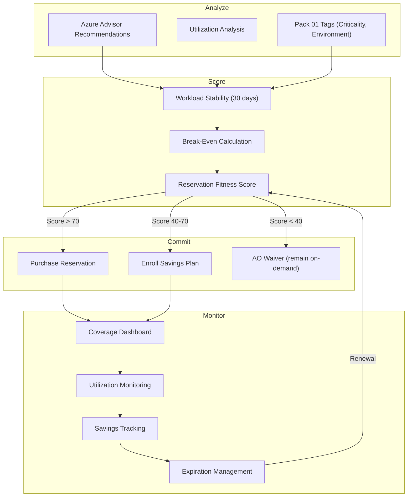

# Reserved Instance & Savings Plan Optimization Pack

> On-demand pricing is the cloud equivalent of paying rack rate at a hotel. You're paying full price for something everyone else negotiated a discount on. Reserved Instances and Savings Plans are the negotiation. This pack ensures you negotiate well, commit wisely, and never pay rack rate for predictable workloads.

[]()
[]()

---

## Start Here

| You Are | Read This First |
|---------|----------------|
| **Hiring Manager** | This README then [`expected-vs-observed.md`](docs/expected-vs-observed.md) — proves cost optimization is evidence-based, not guesswork |
| **Consulting Client** | [`expected-vs-observed.md`](docs/expected-vs-observed.md) — are you paying rack rate on workloads that run 24/7? |
| **Auditor / GRC** | [`expected-vs-observed.md`](docs/expected-vs-observed.md) then [`control-mapping.md`](docs/control-mapping.md) — FinOps Foundation, NIST alignment |
| **CFO / Finance** | This README — proves every commitment decision is backed by utilization data and break-even analysis |
| **Engineer** | [`/code/`](code/) for reservation analysis and [`reservation-operations-runbook.md`](docs/reservation-operations-runbook.md) |

---

## The Problem

Cloud providers offer three pricing models: on-demand (pay as you go), reserved (commit for 1-3 years at a discount), and savings plans (commit to a spending level for a discount). The economics are straightforward — a 1-year reservation on an Azure VM saves roughly 30-40% over on-demand. A 3-year reservation saves 55-65%.

The problem is not understanding the math. The problem is making the commitment. A reservation is a bet — you're betting that this workload will run at this size for this duration. If you bet right, you save thousands. If you bet wrong, you've prepaid for something you don't use. The unused reservation bleeds money every hour it sits idle.

Most organizations do one of two things: they buy no reservations (paying full rack rate on everything, overspending by 30-40%), or they buy reservations without rigorous analysis (overcommitting, then discovering 15% of their reservations sit unused). Both are governance failures.

This pack provides the analysis framework to commit with confidence — utilization data, break-even calculations, workload stability assessment, and reservation coverage monitoring to ensure commitments remain justified.

---

## What This Pack Delivers

| Capability | What It Does | How |
|-----------|-------------|-----|
| **Commitment coverage analysis** | Identify on-demand workloads eligible for reservation or savings plan | Azure Advisor + custom utilization analysis |
| **Break-even calculator** | Calculate exactly when a reservation pays for itself | Days to break-even based on discount vs commitment |
| **Utilization monitoring** | Track reservation utilization to prevent waste | Azure Cost Management reservation utilization reports |
| **Right-commitment scoring** | Score each workload on reservation fitness | Stability, utilization, lifecycle, and criticality factors |
| **Savings tracking** | Measure actual savings vs on-demand counterfactual | Monthly savings report by reservation and savings plan |
| **Expiration management** | Track reservation expiry and renewal decisions | Expiry dashboard with renewal recommendation |

---

## Architecture


---

## Reservation Fitness Score

Not every workload should be reserved. The Reservation Fitness Score evaluates whether a commitment is justified:

| Factor | Weight | What It Measures | Source |
|--------|--------|-----------------|--------|
| **Utilization Stability** | 30% | Consistent usage over 30 days (low variance = high score) | Azure Monitor metrics |
| **Runtime Hours** | 25% | Percentage of hours the resource runs per month | Azure Cost Management |
| **Workload Lifecycle** | 20% | Expected remaining lifetime (>12 months for 1-year RI) | Pack 01 tags: ExpiryDate, ReviewDate |
| **Environment** | 15% | Production = high fitness; dev/test/sandbox = low | Pack 01 tags: Environment |
| **Criticality** | 10% | Critical workloads justify commitment | Pack 01 tags: Criticality |

### Scoring Thresholds

| Score | Recommendation | Rationale |
|-------|---------------|-----------|
| **70-100** | **Reserve (1-year or 3-year RI)** | Stable, production, long-lived. The bet is safe. |
| **40-69** | **Savings Plan** | Moderate stability. Savings Plan provides flexibility across instance families. |
| **Below 40** | **Remain on-demand** | Unstable, short-lived, or dev/test. On-demand premium is insurance against waste. |

> **Watchstander Note:** A reservation with 95% utilization saves 35% on compute. A reservation with 60% utilization saves nothing — you've prepaid for idle hours. The fitness score exists to prevent the second scenario. We'd rather pay rack rate on an uncertain workload than commit to a reservation we can't fill.

---

## Break-Even Analysis

For every candidate workload:
```
Monthly on-demand cost:     $420.00
1-year RI monthly cost:     $273.00 (35% discount)
Monthly savings:            $147.00
Upfront cost (if any):      $0 (monthly payment RI)
Break-even:                 Month 1 (immediate with monthly payment)

3-year RI monthly cost:     $189.00 (55% discount)
Monthly savings:            $231.00
Commitment duration:        36 months
Total savings over term:    $8,316.00
Risk if decommissioned:     $189 × remaining months
```

The break-even calculation answers: "If this workload disappears in month N, did we still save money?" For a 3-year RI, the answer depends on how long the workload actually runs. The fitness score predicts that probability.

---

## Savings Plan vs Reserved Instance Decision Matrix

| Factor | Reserved Instance | Savings Plan |
|--------|------------------|-------------|
| **Discount** | Higher (up to 65% for 3-year) | Moderate (up to 50%) |
| **Flexibility** | Locked to instance family and region | Flexible across families and regions |
| **Best for** | Stable, predictable workloads | Variable workloads with consistent spend |
| **Risk** | Higher — locked to specific config | Lower — spend commitment, not resource commitment |
| **Recommendation** | Fitness score > 70, production, 24/7 | Fitness score 40-69, mixed workloads |

---

## Compliance Mapping

| Framework | Control ID | Control Name | Implementation |
|-----------|-----------|--------------|----------------|
| FinOps Foundation | Capability: Rate Optimization | Commitment-based discounts | Reservation + Savings Plan analysis |
| FinOps Foundation | Capability: Usage Optimization | Maximize utilization of commitments | Utilization monitoring |
| NIST 800-53 | SA-4 | Acquisition Process | Cost-optimized procurement decisions |
| NIST 800-53 | PM-30 | Supply Chain Risk Management | Vendor commitment governance |

> Full mapping: [`docs/control-mapping.md`](docs/control-mapping.md)

---

## What's Included

### `code/` — Analysis, Scoring, and Monitoring

| File | Description |
|------|-------------|
| `reservation-fitness-score.py` | Python: score workloads on reservation fitness (5 factors) |
| `break-even-calculator.py` | Python: break-even analysis for RI and Savings Plan candidates |
| `reservation-coverage-report.py` | Python: current reservation coverage and utilization metrics |
| `savings-tracker.json` | Monthly savings tracking: actual vs on-demand counterfactual |
| `reservation-register.json` | All active reservations: type, term, utilization, expiry |
| `deploy-reservation-monitoring.ps1` | PowerShell: deploy monitoring configuration |

### `docs/` — SOPs, Runbooks, Evidence

| File | Description |
|------|-------------|
| [`expected-vs-observed.md`](docs/expected-vs-observed.md) | The Law of Evidence — 10 controls |
| [`reservation-operations-runbook.md`](docs/reservation-operations-runbook.md) | Full reservation management SOP |
| [`control-mapping.md`](docs/control-mapping.md) | FinOps Foundation / NIST alignment |

### `screenshots/` — Evidence

| # | What It Shows |
|---|--------------|
| 01 | Azure Advisor reservation recommendations |
| 02 | Reservation fitness score output for candidate workloads |
| 03 | Break-even analysis for top candidates |
| 04 | Reservation utilization dashboard |
| 05 | Monthly savings report: actual vs on-demand |

---

## Deployment Guide

| Step | Action | Duration |
|------|--------|----------|
| 1 | Run Azure Advisor to identify reservation candidates | 30 min |
| 2 | Export 30-day utilization data for candidates | 1 hour |
| 3 | Run reservation fitness scoring on candidates | 1 hour |
| 4 | Run break-even analysis on scored candidates | 1 hour |
| 5 | Present recommendations to Principal + Finance | 1 hour |
| 6 | Purchase approved reservations / enroll savings plans | 1 hour |
| 7 | Configure utilization monitoring | 1 hour |
| 8 | Establish monthly savings tracking | 30 min |
| 9 | Run 30-day utilization review on new commitments | 30 days |
| 10 | Capture screenshots and complete E-v-O | 1 hour |

---

## Related Packs

| Pack | Relationship |
|------|-------------|
| [Cost Governance & Tagging](../01-cost-governance-tagging/) | Tags (Environment, Criticality, ExpiryDate) feed fitness scoring |
| [Anomaly Detection](../02-anomaly-detection-alerting/) | Growth-disposition anomalies feed reservation candidates |
| [Chargeback & Showback](../04-chargeback-showback/) | Reservation savings attributed to cost centers and projects |
| [Waste Elimination](../05-waste-elimination-rightsizing/) | Underutilized reservations feed waste analysis |

---

## Changelog

| Version | Date | Change |
|---------|------|--------|
| 1.0.0 | 2026-02-12 | Initial release |

---

<div align="center">

**© 2026 Stella Maris Governance LLC**

*The work speaks for itself. Stella Maris — the one light that does not drift.*

</div>
