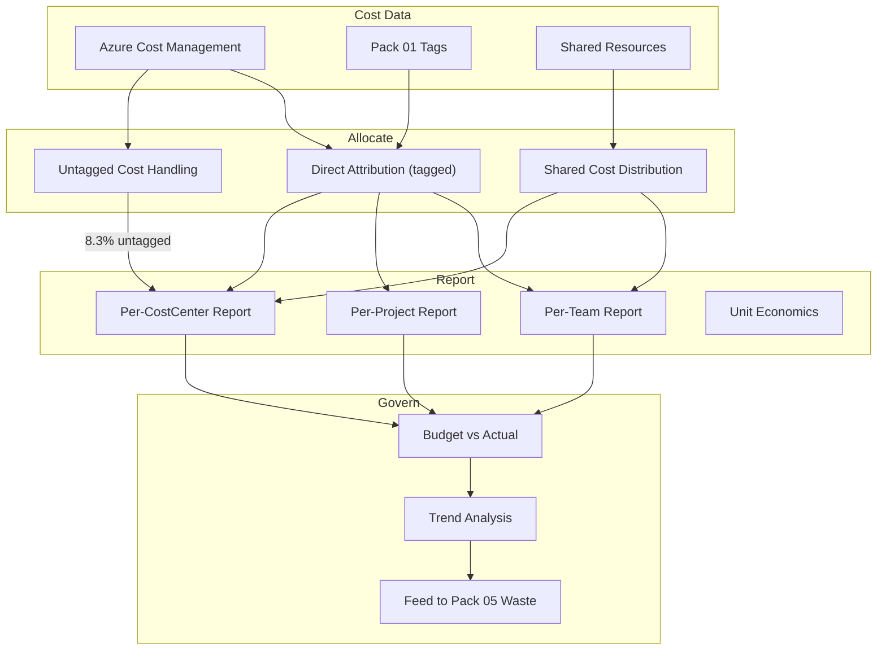

# Chargeback & Showback Pack

> "Where did the money go?" is a question that should never require more than 30 seconds to answer. Chargeback assigns cost to the team that incurred it. Showback makes cost visible to the team that incurred it. Together, they transform cloud spending from an opaque corporate expense into a transparent, accountable, per-team operating cost. The team that provisions the resource owns the bill.

---

> **Governance Notice** — This pack is governed by the [Stella Maris Constitution (CONST-01)](https://github.com/stella-maris-governance/smg-enterprise-hq) and enforces **POL-FIN-01 (Financial Operations) · FinOps Foundation · NIST PM-3**. All dispositions are subject to the Two-Person Integrity Protocol.

---

## Start Here

| You Are | Read This First |
|---------|----------------|
| **Hiring Manager** | This README then [`expected-vs-observed.md`](docs/expected-vs-observed.md) — proves cost accountability is built into the governance model |
| **Consulting Client** | [`expected-vs-observed.md`](docs/expected-vs-observed.md) — can you tell each team exactly what they spent last month? |
| **Auditor / GRC** | [`expected-vs-observed.md`](docs/expected-vs-observed.md) then [`control-mapping.md`](docs/control-mapping.md) — FinOps Foundation, NIST alignment |
| **CFO / Finance** | This README — proves every dollar is traceable to a team, project, and cost center |
| **Engineer** | [`/code/`](code/) for allocation engine and [`chargeback-operations-runbook.md`](docs/chargeback-operations-runbook.md) |

---

## The Problem

In traditional IT, costs were simple. You bought a server, depreciated it over 5 years, and allocated it to the department that requested it. The cost was fixed, predictable, and attributable.

Cloud destroyed that model. Costs are variable. They accrue by the hour. A single team can spin up $5,000 in compute over a weekend without a procurement process, a purchase order, or anyone in finance knowing it happened. The invoice arrives at month-end as a single line item — "Azure: $47,312" — with no breakdown of who spent what, on which project, for what purpose.

Without chargeback, cloud is a tragedy of the commons. Every team has an incentive to provision because the cost is socialized. Nobody owns the bill because everybody shares it. The result is predictable: costs grow faster than the business, nobody is accountable, and the CFO asks "why is our cloud bill up 40%?" and nobody can answer.

Chargeback solves this by making the team that provisions the resource own the cost. Showback solves the information problem by making costs visible even before formal chargeback. Both depend entirely on Pack 01 tagging — without tags, costs are unattributable. With tags, every dollar has an owner.

---

## What This Pack Delivers

| Capability | What It Does | How |
|-----------|-------------|-----|
| **Cost allocation engine** | Attribute every dollar to Owner, CostCenter, Project, Environment | Pack 01 tags + Azure Cost Management |
| **Showback reports** | Monthly cost visibility reports per team, project, and cost center | Automated report generation |
| **Chargeback model** | Formal cost assignment with shared cost allocation rules | Allocation engine with configurable split methods |
| **Shared cost distribution** | Fairly allocate shared resources (networking, security tools, platform) | Proportional, equal, or fixed allocation |
| **Unit economics** | Cost per user, cost per transaction, cost per environment | Normalization against business metrics |
| **Budget vs actual** | Per-team budget tracking with variance analysis | Monthly variance reports |

---

## Architecture

---

## Cost Allocation Model

### Layer 1 — Direct Attribution (Tagged Resources)

Resources with Pack 01 required tags are directly attributable:

| Tag | Allocation Target | Example |
|-----|------------------|---------|
| **Owner** | Individual or team responsible | `dev-team` owns $2,400/month compute |
| **CostCenter** | Financial department code | CC-1001 (Engineering): $3,200/month |
| **Project** | Workload or initiative | customer-portal: $1,800/month |
| **Environment** | Deployment tier | production: 62%, development: 24%, staging: 14% |

At 91.7% tag compliance (Pack 01 current), 91.7% of costs are directly attributable.

### Layer 2 — Shared Cost Distribution

Some resources serve multiple teams and cannot be directly attributed:

| Shared Resource | Allocation Method | Rationale |
|----------------|-------------------|-----------|
| **Virtual Network / VPN Gateway** | Proportional by connected resource cost | Teams using more compute benefit more from networking |
| **Azure AD / Entra ID licensing** | Equal per user | Each user consumes one license regardless of usage |
| **Defender for Cloud** | Proportional by protected resource count | Teams with more resources generate more security cost |
| **Key Vault** | Proportional by transaction count | Teams making more API calls drive more cost |
| **Log Analytics workspace** | Proportional by ingestion volume | Teams generating more logs drive more cost |
| **Shared storage (backups)** | Proportional by data volume | Teams with more data generate more backup cost |

### Layer 3 — Untagged Cost Handling

The 8.3% of costs without required tags (Pack 01 backfill in progress):

| Approach | Description | When Used |
|----------|-------------|-----------|
| **Default to subscription owner** | Untagged costs charged to subscription-level cost center | Interim while backfill completes |
| **Quarantine bucket** | Untagged costs isolated and reported separately | Visibility into tagging gaps |
| **Escalation** | Untagged resources flagged to engineering for tagging | Weekly report to engineering lead |

> **Watchstander Note:** Untagged costs are a governance failure, not a cost allocation failure. The cost was incurred — someone spent the money. The fact that we can't attribute it to a team means the team escaped accountability. The quarantine bucket exists to make that escape visible. Pack 01 deny policy prevents NEW untagged resources. The backfill campaign closes the legacy gap.

---

## Showback vs Chargeback

| Dimension | Showback | Chargeback |
|-----------|----------|------------|
| **Purpose** | Visibility — "this is what you spent" | Accountability — "this IS your budget" |
| **Enforcement** | Informational | Financial |
| **Audience** | Engineering teams | Finance + Engineering |
| **Prerequisites** | Pack 01 tags, Cost Management | Showback + budget approval + GL integration |
| **Maturity** | FinOps Crawl/Walk | FinOps Run |
| **Current state** | ✅ Operational | 📋 Designed, ready for finance integration |

This pack implements **Showback first** (visibility) with **Chargeback-ready** allocation model. The allocation engine, shared cost rules, and reporting framework support both. The difference is whether the reports feed informational dashboards (showback) or general ledger entries (chargeback).

---

## Unit Economics

Beyond raw cost, normalize against business metrics:

| Metric | Calculation | What It Tells You |
|--------|------------|-------------------|
| **Cost per user** | Total cost ÷ active users | Is cost scaling with adoption or faster? |
| **Cost per transaction** | Compute cost ÷ transaction count | Is efficiency improving or degrading? |
| **Cost per environment** | Environment cost ÷ environment count | Is dev/test proportional to production? |
| **Cost per project** | Project cost ÷ project revenue | Is the project profitable at infrastructure level? |

---

## Compliance Mapping

| Framework | Control ID | Control Name | Implementation |
|-----------|-----------|--------------|----------------|
| FinOps Foundation | Capability: Cost Allocation | Attribute costs to organizational units | Allocation engine, Pack 01 tags |
| FinOps Foundation | Capability: Showback / Chargeback | Make costs visible and accountable | Reports, budget vs actual |
| NIST 800-53 | SA-4 | Acquisition Process | Cost accountability in procurement |
| NIST 800-53 | PM-30 | Supply Chain Risk Management | Vendor cost attribution |

> Full mapping: [`docs/control-mapping.md`](docs/control-mapping.md)

---

## What's Included

### `code/` — Allocation, Reporting, and Tracking

| File | Description |
|------|-------------|
| `cost-allocation-engine.py` | Python: allocate costs by tag with shared cost distribution |
| `showback-report.py` | Python: generate per-team, per-project, per-cost-center reports |
| `shared-cost-rules.json` | Shared resource allocation rules (method + rationale) |
| `chargeback-model.json` | Full allocation model: direct + shared + untagged |
| `budget-vs-actual.json` | Per-team budget tracking with variance |
| `deploy-chargeback.ps1` | PowerShell: deploy reporting configuration |

### `docs/`

| File | Description |
|------|-------------|
| [`expected-vs-observed.md`](docs/expected-vs-observed.md) | The Law of Evidence — 10 controls |
| [`chargeback-operations-runbook.md`](docs/chargeback-operations-runbook.md) | Full allocation and reporting SOP |
| [`control-mapping.md`](docs/control-mapping.md) | FinOps Foundation / NIST alignment |

### `screenshots/` — Evidence

This pack uses **deterministic engine outputs** as primary evidence rather than portal screenshots.

| Evidence Type | Format | Purpose |
|--------------|--------|---------|
| Engine output (`.txt`) | Script terminal output | Primary — proves logic and methodology |
| Report output (`.md`) | Formatted engine report | Primary — proves analysis and findings |
| Portal screenshot (`.png`) | Azure portal capture | Secondary — added when running against live environment |

> See `EVIDENCE-README.md` in the screenshots directory for the full evidence approach.

---

## Related Packs

| Pack | Relationship |
|------|-------------|
| [Cost Governance & Tagging](../01-cost-governance-tagging/) | Tags are the foundation — without tags, costs are unattributable |
| [Anomaly Detection](../02-anomaly-detection-alerting/) | Anomaly costs attributed to responsible team via tags |
| [Reserved Instance Optimization](../03-reserved-savings-optimization/) | Reservation savings credited to the team that benefited |
| [Waste Elimination](../05-waste-elimination-rightsizing/) | Waste costs attributed to responsible owner for remediation |
| [Supply Chain Pack 07](../../supply-chain-scrm-packs/07-sla-governance/) | Vendor SLA credits tracked and attributed |

---

## Changelog

| Version | Date | Change |
|---------|------|--------|
| 1.0.0 | 2026-02-12 | Initial release |

---

**© 2026 Stella Maris Governance LLC**

*The work speaks for itself. Stella Maris — the one light that does not drift.*

